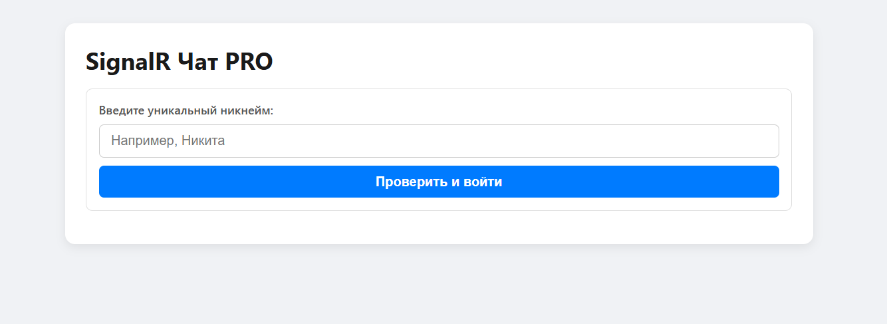
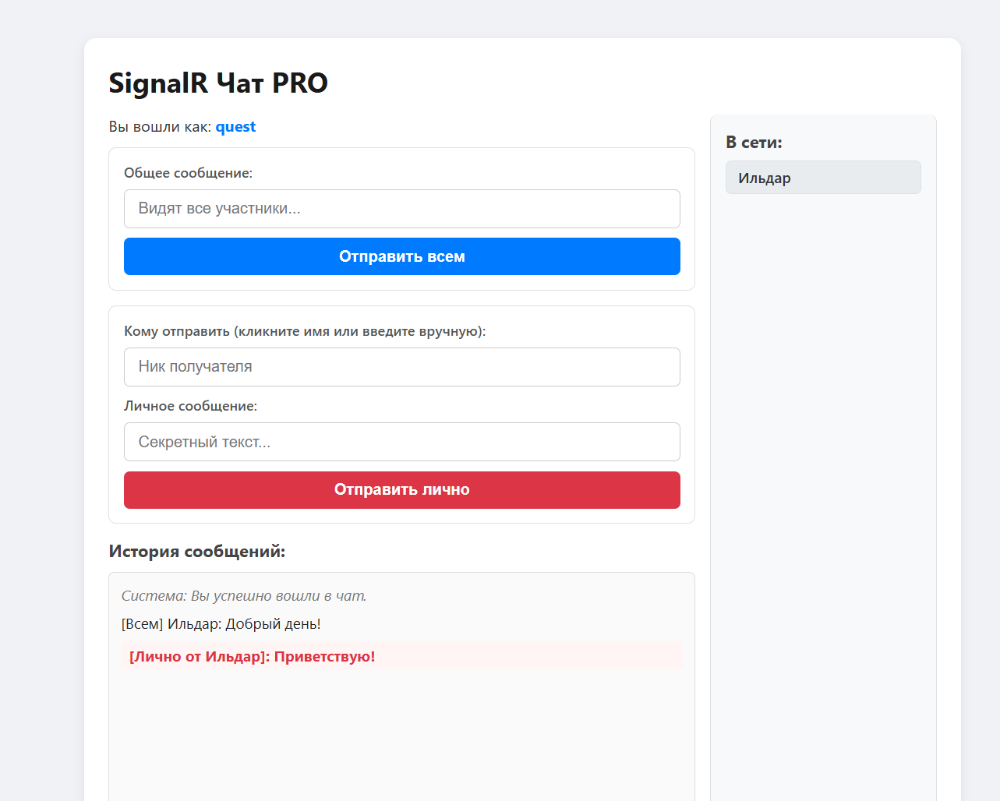

# SignalR Chat

Простой адаптивный веб-чат с возможностью обмена личными сообщениями в реальном времени, построенный на базе ASP.NET Core SignalR.

## Функционал
- **Регистрация пользователя** — проверка уникальности никнейма на сервере при входе.
- **Общий чат** — трансляция сообщений всем активным участникам.
- **Личные сообщения** — отправка приватных сообщений конкретному пользователю по клику на его ник.
- **Список онлайн** — динамическое обновление списка пользователей в сети (без перезагрузки страницы).
- **Адаптивный интерфейс** — корректная верстка, оптимизированная для мобильных устройств и десктопов.

---

## Скриншоты


*Экран авторизации и проверки уникальности никнейма*


*Интерфейс общего и приватного чата со списком пользователей онлайн*

---

## Технологический стек
- **Backend:** .NET 10, ASP.NET Core SignalR, Web API
- **Frontend:** HTML5, CSS3 (Flexbox/Media Queries), JavaScript (SignalR JS Client via CDN)
- **Архитектура:** `ConcurrentDictionary` на стороне сервера для потокобезопасного управления сессиями пользователей в памяти.

---

## Как запустить проект локально

### 1. Требования
- Установленный [.NET SDK](https://microsoft.com) (версии 8.0 или выше).

### 2. Клонирование и запуск
Выполните следующие команды в терминале:

```bash
# Клонируйте репозиторий
git clone https://github.com

# Перейдите в папку проекта
cd SignalR-Chat

# Восстановите зависимости и запустите проект
dotnet run
```

После запуска откройте браузер по адресу, указанному в консоли. Чтобы протестировать личные сообщения, откройте две разные вкладки или воспользуйтесь режимом инкогнито.
